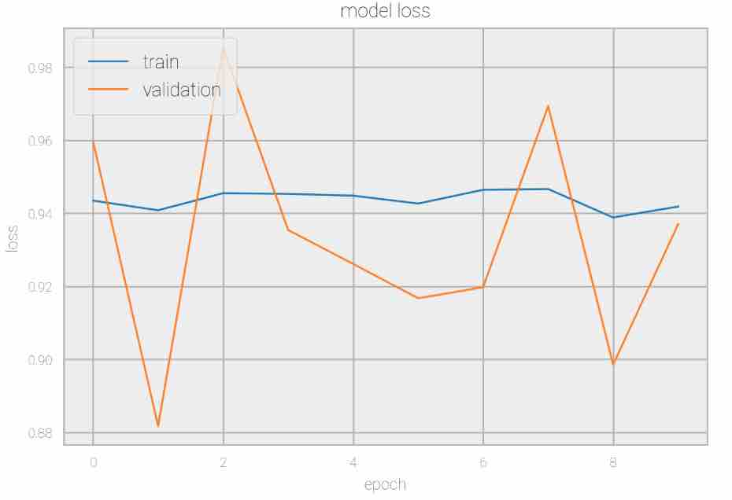
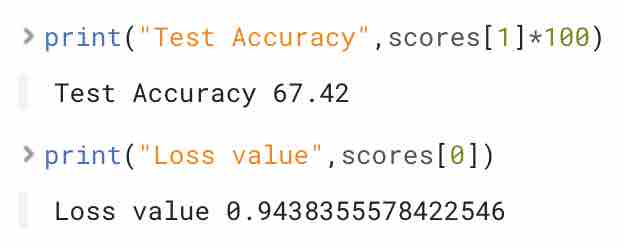
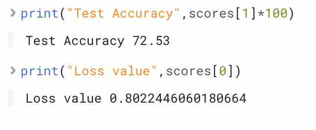
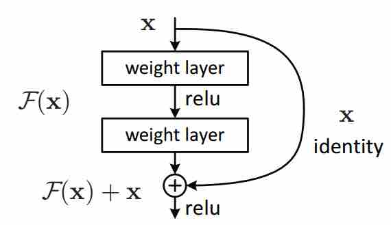
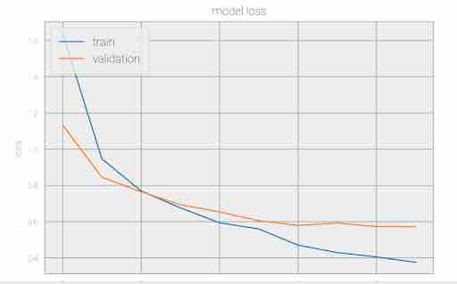
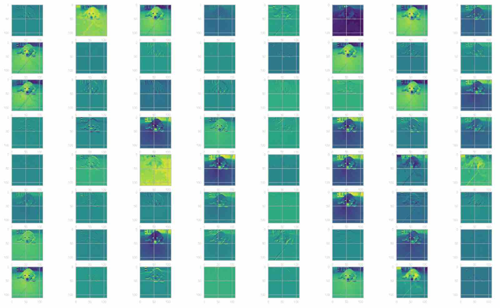
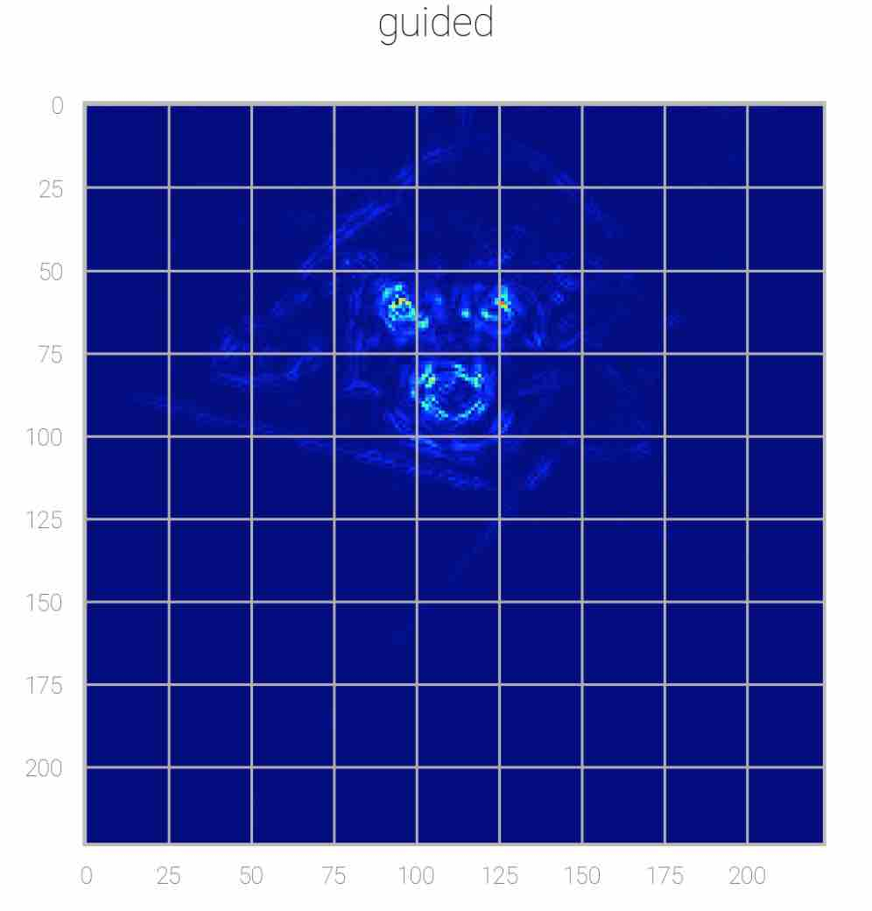
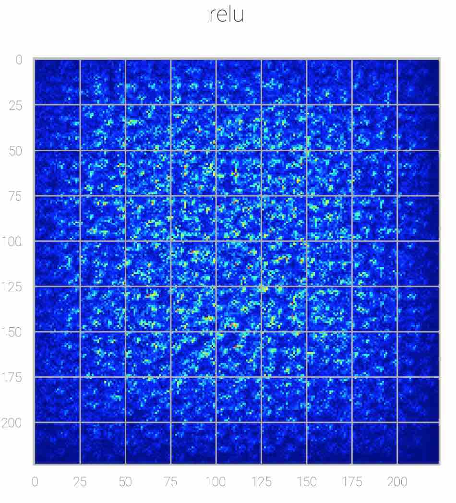
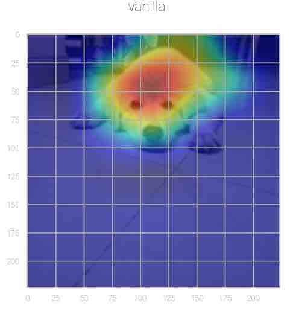
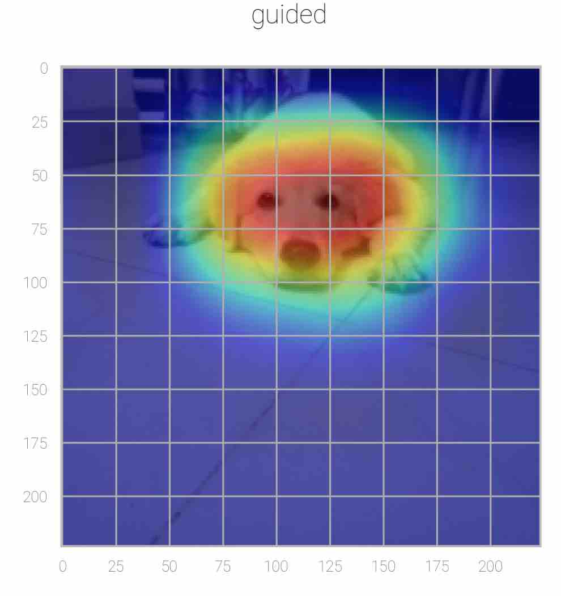

# Building Convolution Neural Network Model
### Introduction
The main objective of this tutorial is to get hands on experience in building a CNN model. This tutorial explains how to fine tune the parameters to improve the model and also use transfer learning to achieve state of the art performance. Finally you will understand the concept of model interpretability through which CNN makes decisions. To get started with this tutorial you should have some background knowledge of python and neural network concepts to understand better.

### Prerequisites
- Read through “Introduction to Convolution Neural Networks Tutorial”
- Read through “Getting started with CDSW”
- Knowledge of Python and  Neural Network basic concepts
### Goals and Objectives
- Understand how to build a sequential CNN model
- Understand how to make use of data transformation techniques
- Understand how to fine tune parameters
- Understand how to use transfer learning
- Understand the interpretability of the CNN models

### Outline
- Build your CNN model
- Introduction to Transfer Learning
- Interpretation of CNN model

### 1. Build you Convolution Neural Network model
### 1.1 Setting up your environment

- Using Getting started with CDSW tutorial create your own project and choose python session
- Make sure to install keras library on to your session
- Install numpy, matplotlib

### 1.2 Implementation
**Step1 :** Import all the libraries necessary to run your code
~~~
import keras
from keras.datasets import cifar10
from keras.preprocessing.image import ImageDataGenerator
from keras.models import Sequential
from keras.layers import Dense, Dropout, Activation, Flatten, BatchNormalization
from keras.layers import Conv2D, MaxPooling2D
from keras.utils.np_utils import to_categorical
import matplotlib.pyplot as plt
import numpy as np
~~~
**Note:** If you find any errors importing above packages, try to make sure all modules are installed properly before importing them.

**Step 2:** Import data using keras datasets. 

**Dataset :** CIFAR10 (multi class classification)

**Brief description about dataset:** CIFAR10 dataset is a standard dataset to start with the basics, This dataset consists of 60000 images with size 32X32 with 10 categories of data. They are pretty low resolution images. You can load the dataset using the below command.
~~~
(x_train, y_train), (x_test, y_test) = cifar10.load_data()
~~~
You can check the shape of your data using the below commands.
~~~
print(x_train.shape[0], 'training examples')
print(x_test.shape[0], 'testing examples’')
~~~
Using one hot encoding to convert the data into a feature vector to pass to machine learning models.Convert array of labeled data(from 0 to num_classes-1) to one-hot vector. 
~~~
y_train = keras.utils.to_categorical(y_train, num_classes)
y_test = keras.utils.to_categorical(y_test, num_classes)
~~~
**Step 3:** Initialization of required variables
~~~
batch_size = 32
num_classes = 10
epochs = 10
data_augmentation = True
~~~
Data Augmentation is used to provide better training, you can also turn it off by initializing it to False.

**Step 4:** Building your model. The below model is a Sequential model. 

**Note:** This is an example to understand how to add your layers to a model. You can use different hyper parameters and play around with it to get more understanding on how they work. model.add() function enables you to add your own layers. You can look at keras to view on more models and hyper-parameters.

#### Conv2D Layer:
##### Arguments used:
- **Filters:** This is an integer which denoted the output space dimensionality in each convolution
- **Kernel size:** It represents the height and width of the convolution window to perform convolution operation.
- **Padding:** same(add padding) or valid(do not add padding)
- **Input shape:** provide the dimensions of input, here 32x32x3.

**Activation Layer:**

You will be using RELU activation but you can also try different activation functions for practice.

**Pooling Layer:**

You will be using MaxPooling layer in this model. You can also try using AvgPooling to observe the results.

**Arguments used:**

**Pool size:** It is an integer or tuple used to downscale. Here we used (2, 2) which  will halve the input in both spatial dimension(height, width)

**Dropout Layer:** Dropout layer is used to minimize overfitting.

**Flatten Layer:** Flattens the input into a single column vector to pass it into ANN which is Dense Layer.

Below is the basic model built using keras. Now you can copy the model and execute it on CDSW.
~~~
model = Sequential()
model.add(Conv2D(6, (3, 3), padding='same',
                 input_shape=x_train.shape[1:]))
                 model.add(Activation('relu'))
model.add(Conv2D(16, (3, 3)))
model.add(Activation('relu'))
model.add(MaxPooling2D(pool_size=(2, 2)))
model.add(Conv2D(16, (3, 3), padding='same'))
model.add(Activation('relu'))
model.add(Conv2D(32, (3, 3)))
model.add(Activation('relu'))
model.add(MaxPooling2D(pool_size=(2, 2)))
model.add(Flatten())
model.add(Dense(512))
model.add(Activation('relu'))
model.add(Dropout(0.5))
model.add(Dense(num_classes))
model.add(Activation('softmax'))
~~~
Converting the datatype to float to perform operations
~~~
x_train = x_train.astype('float32')
x_test = x_test.astype('float32')
~~~
Rescaling the image to stay between 0 and 1

~~~
x_train /= 255
x_test /= 255
~~~

**Step5:** Once the model is built it's time to compile the model using below command. You will be using categorical_crossentropy as loss function and metrics as accuracy.
~~~
opt = keras.optimizers.adam()
model.compile(loss='categorical_crossentropy',
              optimizer=opt,
              metrics=['accuracy'])
~~~

**Step 6:** Once the model is compiled you have to fit the model using the training data and validation data, the validation data is used the same as the test data. The history variable records the metrics.

Provide an option to perform Data Augmentation when required
~~~
if not data_augmentation:
    print('Not using data augmentation.')
    model.fit(x_train, y_train,
              batch_size=batch_size,
              epochs=epochs,
              validation_data=(x_test, y_test),
              shuffle=True)
else:
    print('Using real-time data augmentation.')
    # This will do preprocessing and real time data augmentation:
    datagen = ImageDataGenerator(
    rotation_range=15,
    width_shift_range=0.1,
    height_shift_range=0.1,
    horizontal_flip=True,
        )
~~~
When Data Augmentation is set to True fit the data as below
~~~
datagen.fit(x_train)
~~~
Before fitting the model set seed to reproduce the results

~~~
from numpy.random import seed
seed(1)
~~~

**Step 7:** Once the model is compiled you have to fit the model using the training data and validation data is used the same as the test data and the history variable records the metrics.

~~~
 history=  model.fit_generator(datagen.flow(x_train, y_train,
                                     batch_size=batch_size),
                        
                        epochs=10,
                        steps_per_epoch=x_train.shape[0] // batch_size,
                        validation_data=(x_test, y_test),
                        shuffle= False)
~~~
**Note:** seed is used for reproducibility, you can observe slight variation in the accuracy scores when you re-run the same model multiple times. Hence to ensure not much variation seed is used. Note that everytime you fit the model again make sure you run the seed command else you might see a huge difference in your accuracy due to random weight assignments.

**Step 8:** Evaluate your results and print the metrics
~~~
scores = model.evaluate(x_test, y_test, batch_size=32, verbose=1)
print("Test Accuracy",scores[1]*100)
print("Loss value",scores[0])
~~~

**Step 9:** Visualize the training and validation loss

The loss for the 10 epochs is shown below:
~~~
def plotLosses(history):  
    plt.plot(history.history['loss'])
    plt.plot(history.history['val_loss'])
    plt.title('model loss')
    plt.ylabel('loss')
    plt.xlabel('epoch')
    plt.legend(['train', 'validation'], loc='upper left')
    plt.show()
    
plotLosses(history)
~~~

You can make some of the modifications in the hyper parameters and architectural structure to improve accuracy. Come  up with your own ideas to make changes to this model. Here are few techniques which can improve accuracy

- Use of Data Augmentation
- Use of LRfinder and cyclic LR to find out best learning rate
- Can also use heuristic approach of providing custom smaller learning rates and decreasing it when epochs increases using keras LearningRateScheduler
- Using additional layers and build more deep neural network with appropriate hyper parameters

Some of the techniques you can try shown below to observe the difference. Feel free to use different hyper parameters and optimizers for your model.

In the above code you have already set the Data Augmentation to True, now set the variable as false and re run the model. You could observe the model performing very poorly.

Now let us transform the data and change the number of filters as follows:

After loading your dataset run the below commands
~~~
mean = np.mean(x_train,axis=(0,1,2,3))
std = np.std(x_train,axis=(0,1,2,3))
x_train = (x_train-mean)/(std+1e-7)
x_test = (x_test-mean)/(std+1e-7)
~~~
Change the number of filters in the model as below
~~~
model = Sequential()
model.add(Conv2D(32, (3, 3), padding='same',
                 input_shape=x_train.shape[1:]))
model.add(Activation('relu'))
model.add(Conv2D(32, (3, 3)))
model.add(Activation('relu'))
model.add(MaxPooling2D(pool_size=(2, 2)))
model.add(Conv2D(64, (3, 3), padding='same'))
model.add(Activation('relu'))
model.add(Conv2D(128, (3, 3)))
model.add(Activation('relu'))
model.add(MaxPooling2D(pool_size=(2, 2)))
model.add(Flatten())
model.add(Dense(512))
model.add(Activation('relu'))
model.add(Dropout(0.5))
model.add(Dense(num_classes))
model.add(Activation('softmax'))
~~~
Now try to recompile the model and fit the model you would definitely observe difference in the loss and accuracy.

Try to fix the learning rate of the optimizer, recompile and fit the model. Here 0.0001 is used as the learning rate.

**Note:** This might not be the best thing to do but this is just to observe how the model behaves on your inputs. Usually models start with low learning rates.

You can use LRscheduler with your customized learning rates through the epochs. Observe that learning rate should decrease as you go deeper into epochs to converge.

~~~
def lr_schedule(epoch):
    lrate = 0.0001
    if epoch > 5:
        lrate = 0.00005
    if epoch > 10:
        lrate = 0.00003
    return lrate
~~~

Note: This was only scheduled for 10 epochs. This can be changed according to the number of epochs.

Recompile and refit the model
~~~
opt = keras.optimizers.adam(lr=0.0001)
model.compile(loss='categorical_crossentropy',
              optimizer=opt,
              metrics=['accuracy'])

from numpy.random import seed
seed(1)
history= res_model.fit_generator(datagen.flow(x_train, y_train, batch_size=batch_size),\
                    steps_per_epoch=x_train.shape[0] // batch_size,epochs=10,\
                    verbose=1,validation_data=(x_test,y_test), shuffle= False, callbacks=[LearningRateScheduler(lr_schedule)])
~~~
Adding a Batch Normalization Layer

**Importance of Batch Normalization**

The main purpose of Batch Normalization is to reduce the internal covariance shift. When the deep neural network is trained, the parameters of the preceding layers change and the distribution of the inputs to the current layer also need to constantly rearrange itself to adjust with the new parameters. This is a great overhead and is also severe in deep layers because the shallow layers will be amplified to further layers in the network resulting in a huge shift in deeper hidden layers, hence this layer will reduce the unwanted shifts during the training and speeds up the process. Also helps to reduce vanishing gradient problem.

Import this layer using from keras.layers import BatchNormalization
~~~
model = Sequential()
model.add(Conv2D(32, (3, 3), padding='same',
                 input_shape=x_train.shape[1:]))
model.add(Activation('relu'))
model.add(Conv2D(32, (3, 3)))
model.add(Activation('relu'))
model.add(BatchNormalization())
model.add(MaxPooling2D(pool_size=(2, 2)))
model.add(Conv2D(64, (3, 3), padding='same'))
model.add(Activation('relu'))
model.add(Conv2D(128, (3, 3)))
model.add(Activation('relu'))
model.add(MaxPooling2D(pool_size=(2, 2)))
model.add(Flatten())
model.add(Dense(512))
model.add(Activation('relu'))
model.add(Dropout(0.5))
model.add(Dense(num_classes))
model.add(Activation('softmax'))
~~~

Look into this paper to understand the advanced concept called cyclic learning rates and LRfinder for better choosing of the learning rate.[link]

Typical training process is explained by the below figure.

### 2. Introduction to Transfer Learning
### 2.1 Introduction
In this section you will learn about transfer learning, how to use state of the art algorithms to train your dataset and also understand the importance of transfer learning. This section will focus on one of the models known as RESNET50 which is the winner of IMAGENET challenge in 2015. You can also apply the same methodology to various state of the art algorithms for your own use cases.

Due to the advancements in computational resources, deep neural networks have gained its importance to solve various problems. But then if you have to build your own Neural Network with the state of the art performance you might require access to GPUs which might cost you more than you think. In real life to deal with complex problem it is always useful to think smartly on how to utilize the resources which are already available to us. Thankfully transfer learning helps in using pretrained models which has already attained state of the art performance and you can finetune it according to your use case very easily and gain more accurate results with small changes.
**Why transfer learning is useful?**
Transfer learning is similar to knowledge transfer in real life. Consider an example where you join a sports team and learn from your coach on how to play and gain expert advice and knowledge from your coach experiences which can help you to face situations in future. In the similar way a deep neural network which is already trained on a huge dataset and has knowledge about it in the form of weights, you can use this knowledge to solve your own problems by making very little changes as per you need instead of building your model from scratch.

Most of the time spent on building your own model as seen in the previous section would be the time spent on trial and error methodology to see which weights and hyper parameters would finetune your model. Transfer learning helps to avoid wasting time on those aspects.

Using pre trained architecture which is trained on classic IMAGENET dataset which consists of 1000 different classes with more than 1.2 million images, helps you to make your job easier. Thanks to this advancement in pre trained models to build models in less time.

**How to use pre trained models?**
- You can understand the exact architecture followed in pretrained models and can build your own model which can work better in your use case.
- You can also use pre trained models as feature extractor where you just modify the output layer according to your dataset.
- You can also freeze a few of the layers in the pretrained model and then make other layers are trainable to make the model train on your dataset again. But this might lead to updating of the weights and might consume a little more time.
- You can compare your own architecture to pre-trained model to observe the performance which can be learned in this tutorial.

**2.2 Prerequisites**

- Read through “Section 1: Introduction to Convolution Neural Networks”
- Read through “Getting started with CDSW”
- Read through “Section2:Build your own Convolution Neural Network”

**2.3 Goals and Objectives**

- Understand how transfer learning works
- Understand how to implement transfer learning using RESNET50 model
- Fine tuning of parameters

**2.4 Setting up your environment**
- Using Getting started with CDSW tutorial create your own project and choose python session
- Make sure to install keras library on to your session
- Install numpy, matplotlib

**2.5 Outline**
- Brief overview of RESNET50
- Implementation of transfer learning
- Further Reading

**2.6 Brief overview on RESNET50**

Deep neural networks are very hard to train, as they go deeper there is a problem of facing vanishing gradient. RESNET50 is a deep neural network which is a winner in 2015 which bought a great improvement in dealing with the computer vision problem. RESNET50 dealt with the vanishing gradient problem by using skip connections. RESNET50 architecture has resnet blocks which are responsible for dealing with the skip connections. Each layer feeds into the next layer and directly into the layers about 2–3 hops away. But it is very important to understand why this actually helps to build state of the art performance. Let us understand using the image below.

Neural networks are known as universal function approximators and the assumption that accuracy increases with the number of layers added to the network. But there should be a limit on how many layers should be added, if you tend to add as many layers as you want then there is no point in wasting a lot of time on training and also it leads to curse of dimensionality and vanishing gradient problem.This is one of the reasons you can still observe shallow networks performing better the deeper counterparts with additional layers. This leads to a concept of skip connections where you can skip few layers as seen in the above image.You can also observe that identity function learns over the skip connections, hence they are also known as identity shortcut connections. The identity function here is trying to learn the residual block instead of the true output of each layer, this gives an opportunity to have larger gradients in the initial training of the network and helps to train faster giving an ability to train deep neural networks.

Let us understand through the code how to use transfer learning with pretrained ResNet50  model. Using some of the implementations in the previous section let us observe how transfer learning can help.

**2.7 Implementation**

**Step 1:** Import all necessary libraries
~~~
from matplotlib import pyplot
from scipy.misc import toimage
import keras
from keras.datasets import cifar10
from keras.applications.resnet50 import ResNet50
from keras.models import Sequential
from keras.utils import np_utils
from keras.preprocessing.image import ImageDataGenerator
from keras.layers import Dense, Activation, Flatten, Dropout, BatchNormalization
from keras.layers import Conv2D, MaxPooling2D
from keras import regularizers
from keras.callbacks import LearningRateScheduler
import numpy as np
from keras.callbacks import Callback
import math
from keras import models
from keras import layers
from keras import optimizers
from keras.models import Sequential
import matplotlib.pyplot as plt
~~~
**Step2:** Loading and transformation of data
~~~

(x_train, y_train), (x_test, y_test) = cifar10.load_data()

print(x_train.shape[0], 'training examples')
print(x_test.shape[0], 'testing examples’')

y_train = keras.utils.to_categorical(y_train,10)
y_test = keras.utils.to_categorical(y_test,10)

x_train = x_train.astype('float32')
x_test = x_test.astype('float32')

x_train /= 255
x_test /= 255
~~~
**Step 3:** Build the model

Convolution_base layer holds the Resnet50 model with weights as imagenet. Include_top parameter is set to false because we are defining our own output layer to this model with 10 classes. You can also add more layers on top of the base layer. Here we are using batch size as 128. 
~~~
convolution_base = ResNet50(weights= 'imagenet', include_top=False, input_shape=(32, 32, 3))
res_model= models.Sequential()
res_model.add(convolution_base)
res_model.add(layers.Flatten())
res_model.add(Dropout(0.2))
res_model.add(layers.Dense(10, activation='softmax'))
batch_size=128
~~~
Add Data Augmentation
~~~
datagen = ImageDataGenerator(
    rotation_range=15,
    width_shift_range=0.1,
    height_shift_range=0.1,
    horizontal_flip=True,
    )
datagen.fit(x_train)
~~~
**Step 4:** Use LRscheduler as as the previous section and compile the model
~~~
def lr_schedule(epoch):
    lrate = 0.0001
    if epoch > 5:
        lrate = 0.00005
    if epoch > 10:
        lrate = 0.00003
    return lrate
    opt_adam = keras.optimizers.Adam(lr=0.0001)
res_model.compile(loss='categorical_crossentropy', optimizer=opt_adam, metrics=['accuracy'])
~~~
**Step 5:** Fit the model
~~~
from numpy.random import seed
seed(1)

history= res_model.fit_generator(datagen.flow(x_train, y_train, batch_size=batch_size),\
                    steps_per_epoch=x_train.shape[0] // batch_size,epochs=10,\
                    verbose=1,validation_data=(x_test,y_test), shuffle= False, callbacks=[LearningRateScheduler(lr_schedule)])
~~~
**Step 6:** Evaluate the model
~~~
scores = res_model.evaluate(x_test, y_test, batch_size=128, verbose=1)
print("Test Accuracy",scores[1]*100)
print("Loss value",scores[0])
~~~

**Step 7:** Visualize the loss
~~~
def plotLosses(history):  
    plt.plot(history.history['loss'])
    plt.plot(history.history['val_loss'])
    plt.title('model loss')
    plt.ylabel('loss')
    plt.xlabel('epoch')
    plt.legend(['train', 'validation'], loc='upper left')
    plt.show()
    
plotLosses(history)
~~~

Now you can observe a good improvement in the accuracy using the Resnet model with few steps.

**3. Visual Explainations From Convolution Neural Networks**

**3.1 Introduction**

It is often said that deep neural network is a black box and it is very difficult to understand how the model makes predictions. Interpretability of models is very important to trust the model. It iis very important to understand how the model predicts. In order to build trust in intelligent systems and move towards their meaningful integration into our everyday lives, it is clear that we must build ‘transparent’ models that explain why they predict; what they do.There are many techniques developed to understand the representation of the visual concepts and interpreting them. This section focuses on introducing few techniques such as  Grad-CAM and visualizing interpretations of intermediate convolution outputs. This helps in understanding how CNN layers transform their input to get the first idea of the meaning of individual convnet filters. Also you would be able to see which important features of the image is being used to make predictions. By the end of this section you will understand how model uses the important features to make predictions.

**3.2 Outline**

- **Visualizing the intermediate convolution layer outputs:** This will help you to understand how convolution layers transform their inputs to get an idea of the image using the filters.
- **Using Gradient Based visualization methods:** This helps to understand which part of the image had led the model to predict the class. This technique works on localization of objects in images.

**3.3 Visualizing the intermediate convolution layer outputs**

Visualizing the intermediate outputs of convolution layers makes us to understand how the input is transformed by the layers and how different filters are learned by the network. The output of a given input is taken care of by the activation layer which is the activation function output. Let us observe the implementation on how to visualize the activation outputs. Let us try using a custom image to understand it better. You can use your own image to test this.
Run the below code to load the ResNet50 pretrained model and predict the input image. You will make use of keras library to do this quickly.

~~~
from keras.applications import ResNet50
from keras import backend as K
model = ResNet50(weights='imagenet', include_top=True)
from keras.preprocessing import image
from keras.applications.resnet50 import preprocess_input, decode_predictions
import numpy as np
img_path = 'tyson.jpeg' # You can input your image here or use the same image from assets
img = image.load_img(img_path, target_size=(224, 224))
x = image.img_to_array(img)
x = np.expand_dims(x, axis=0)
x = preprocess_input(x)
preds = model.predict(x)
print('Predicted class:', decode_predictions(preds, top=1)[0]) # This will output the predicted label
~~~
As the above code makes prediction on the input image now let us try to understand what made the model predict the class.
~~~
from keras.preprocessing import image
import numpy as np

img = image.load_img(img_path, target_size=(224, 224))
img_tensor = image.img_to_array(img)
img_tensor = np.expand_dims(img_tensor, axis=0)
img_tensor /= 255.

# Its shape is (1, 150, 150, 3)
print(img_tensor.shape)

import matplotlib.pyplot as plt
%matplotlib inline

plt.imshow(img_tensor[0])
plt.show()
from keras import models

layer_outputs = [layer.output for layer in model.layers[1:]]
activation_model = models.Model(inputs=model.input, outputs=layer_outputs)

activations = activation_model.predict(img_tensor)

first_layer_activation = activations[1]
print(first_layer_activation.shape)
~~~

~~~
plt.matshow(first_layer_activation[0, :, :, 3], cmap='viridis')
plt.show()
~~~
The below figure shows the output of the first  activation layer with channel 3. You can try using other activation layers and channels to observe the variations in the interpretations.

Below code helps to visualize the filters applied on image on first activation layer.
~~~
def display_outputs(activations, col_size, row_size, act_index): 
    activation = activations[act_index]
    activation_index=0
    fig, ax = plt.subplots(row_size, col_size, figsize=(row_size*2.5,col_size*1.5))
    for row in range(0,row_size):
        for col in range(0,col_size):
            ax[row][col].imshow(activation[0, :, :, activation_index], cmap='viridis')
            activation_index += 1

display_outputs(activations, 8, 8, 1)
~~~

Below figure shows the output of the activation layer 3
~~~
display_outputs(activations, 8, 8, 3)
~~~

As you can observe in the initial activation the visual interpretations are little better but in deeper activations it is not so visually interpretable and more abstract. In the deeper layers the model is trying to highlight only the areas which makes its prediction stronger such as dog nose, dog ear etc. You can observe some of the filters to be blank in the deeper layers this happens when pattern encoded by filter is not found in the image. We can now understand that deep layers only focus on the high level representations which has greater importance than irrelevant details of the image.

**3.3 Using Gradient Based visualization methods**
**3.3.1 Saliency Maps**
The idea behind saliency is pretty simple in hindsight. We compute the gradient of output category with respect to input image.This should tell us how the output value changes with respect to a small change in inputs. We can use these gradients to highlight input regions that cause the most change in the output. Intuitively this should highlight salient image regions that most contribute towards the output. 

You can use the below code on CDSW to visualize the interpretations.
~~~
from vis.utils import utils
from keras import activations
import warnings
warnings.filterwarnings('ignore')
layer_idx = -1
# Swap softmax with linear
model.layers[layer_idx].activation = activations.linear
model = utils.apply_modifications(model)
from vis.utils import utils
from matplotlib import pyplot as plt
%matplotlib inline
img1 = utils.load_img('tyson.jpeg', target_size=(224, 224))
from vis.visualization import visualize_saliency, overlay
from vis.utils import utils
from keras import activations
layer_idx = -1
grads = visualize_saliency(model, layer_idx, filter_indices=2, seed_input=img1)
plt.imshow(grads, cmap='jet')   

for modifier in ['guided', 'relu']:
    plt.figure()
    plt.suptitle(modifier)
      
 
    grads = visualize_saliency(model, layer_idx, filter_indices=2, 
                                   seed_input=img1, backprop_modifier=modifier)  
    plt.imshow(grads, cmap='jet')
~~~
Although we can see these kind of maps without backpropagation modifiers but we can see more clearly when we apply back propagation modifiers.The most likely reason is that we have optimizers that make it much more complex in terms of determining the direct impact that each pixel would have on the output. The two back propagation algorithms which can be used are guided and relu. In guided saliency, the backprop step is modified to only propagate positive gradients for positive activations. Relu modifies back propagation by zeroing negative gradients and let positive ones go through unchanged.

You can observe that guided is better in visually presenting and highlighting only the important features such as ears, nose, eyes of the dog than the relu representation.

**3.3.2 Grad-CAM**

Class activation maps or grad-CAM is another way of visualizing attention over input. Instead of using gradients with respect to output, grad-CAM uses penultimate (pre Dense layer) Conv layer output. The intuition is to use the nearest Conv layer to utilize spatial information that gets completely lost in Dense layers.

Gradient-weighted Class Activation Mapping (Grad-CAM) uses the class-specific gradient information flowing into the final convolutional layer of a CNN to produce a coarse localization map of the important regions in the image. Grad-CAM is a strict generalization of the Class Activation Mapping (CAM) There typically exists a trade-off between accuracy and simplicity/interpretability. Grad-CAM is highly class-discriminative. (i.e. the ‘tiger’ explanation exclusively highlights the ‘tiger’ regions, and not the ‘dog’ regions and vice versa). Guided Grad-CAM visualizations that are both high-resolution and class-discriminative. As a result, important regions of the image which correspond to a class of interest are visualized in high-resolution detail even if the image contains multiple classes, When visualized for ‘tiger cat’, Guided GradCAM not only highlights the cat regions, but also highlights the stripes on the cat which is important for predicting that particular variety of cat. 
Below is the code which can be used to test this kind of approach. Past the below code on CDSW to view the results.
~~~
import numpy as np
import matplotlib.cm as cm
from vis.visualization import visualize_cam

penultimate_layer = utils.find_layer_idx(model, 'res5c_branch2c')

for modifier in [None, 'guided', 'relu']:
    plt.figure()
    plt.suptitle("vanilla" if modifier is None else modifier)
   
        # 20 is the imagenet index corresponding to `ouzel`
    grads = visualize_cam(model, layer_idx, filter_indices=2, 
                              seed_input=img1, penultimate_layer_idx=penultimate_layer,
                              backprop_modifier=modifier)        
        # Lets overlay the heatmap onto original image.    
    jet_heatmap = np.uint8(cm.jet(grads)[..., :3] * 255)
    plt.imshow(overlay(jet_heatmap, img1))
~~~

### Further Reading

This tutorial gives you a general idea of building the models but the architecture can be made better by adding various hyper parameters. You can start playing with it. Chec out below links for more information.

- [Deep Learning made easier with Transfer Learning](https://blog.fastforwardlabs.com/2018/09/17deep-learning-is-easy-an-introduction-to-transfer-learning.html) : Interesting blog by Cloudera Fast Forward Labs which gives good understanding about Transfer Learning
- [Deep Learning Image Analysis](https://blog.fastforwardlabs.com/2019/07/22/new-research-deep-learning-for-image-analysis.html) : New research by Cloudera Fast Forward Labs on Deep learning Image analysis
- [Keras-Viz](https://raghakot.github.io/keras-vis/vis.visualization/)

