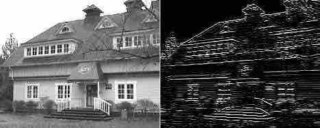
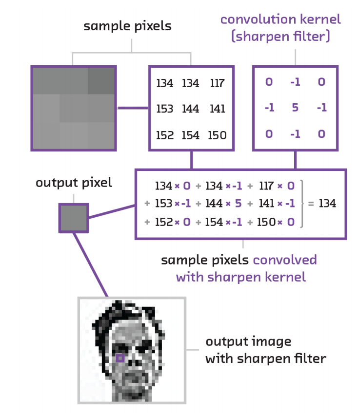
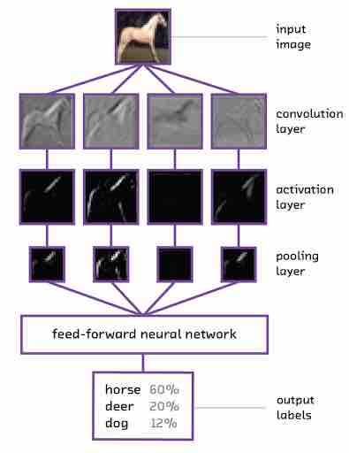
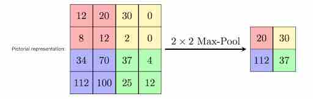
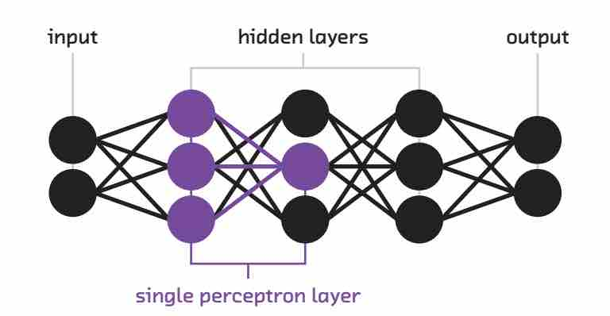
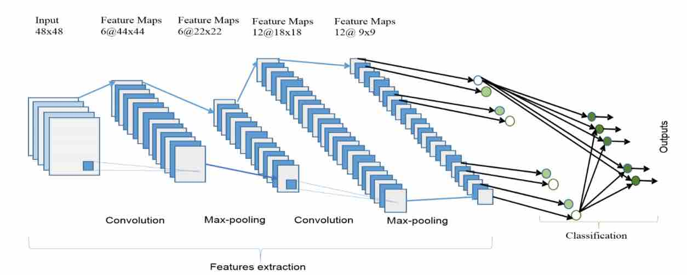
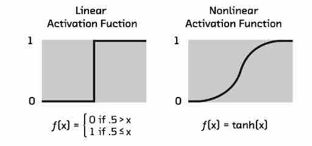
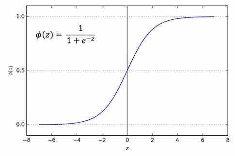
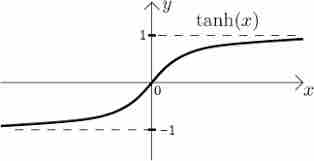
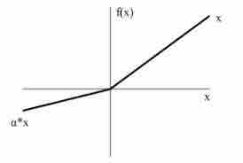

# Introduction to Convolution Neural Networks
### Introduction

Your main objective in this tutorial is to understand the background of building Convolution Neural Networks model. By the end of this section you will be able to create a model by yourself using the concepts. This section will focus on giving the highlights of why you can use CNN to deal with complex data like images, also help you to understand how convolution neural networks evolved over time, how CNN succeeded in image recognition space and underlying mathematics of the building blocks of the model. By the end of this tutorial you should have a handful of tools ready to start using them for your use case.

### Outline
- Convolution Neural Networks Essentials
- Use cases
- Further Reading

### Convolution Neural Networks Essentials

**What are Convolution Neural Networks?**

Convolution Neural Networks are a class of Deep Neural Networks which were proven to gain its importance in visual recognition and classification. The architecture of these networks was loosely inspired by our brain where several number of neurons communicate with each other to provide respond to various inputs. Though the earlier work of using CNN started in early 1980’s these became popular with the recent technology advancements and computational capabilities which allowed to process and use large amounts of data leveraging the power of highly sophisticated algorithms in a reasonable amount of time.

**How Convolution Neural Networks are different from regular Neural Networks?**

In regular Deep Neural Networks you can observe a single vector input which is passed through a series of hidden layers. Each hidden layer is made up of set of neurons which are connected to the previous layers and is then connected to the output layer which results in determining the class scores. It is always a challenge to deal with image data due to its complexity. A model should have the capability to scale well. 
For example if you consider an image with size 64x64x3 (height, width, color channels) then the total number of input features is 12288, and if your first hidden layer contains 100 units it results in a  12288x100 = 122880 weight matrix, which is a regular neural network can still handle. However,  for high resolution images, for example 1000x1000x3, the number of input features will be 3 million and with 1000 neurons in your hidden layer you will have a 3 billion weight matrix which is huge and expensive to compute. To deal with this kind of scenario convolution operation is introduced.

**How Convolution operation works?**

Images are seen by a machine as a matrix of pixel values. One of the important tasks of Convolution layer is to detect edges in an image. For example, look at the image below where a kernel is applied to an image to detect horizontal edges. In order to detect the edges convolution operation helps. Instead of hand picking the kernel values , the convolution layer tries to find out the parameter values which best suit and helps in detecting the vertical and horizontal edges. 

When a convolution layer receives the input, a filter is applied on to the images and is multiplied with the corresponding kernel values and gives the output as a scalar output value. For example, look at the figure below which shows a 3x3 filter used and is mapped onto a few pixels on the image as shown in the left and then dot product is performed this way ( 134x0+134x-1+117x0+153x-1+144x5+141x-1+152x0+154x-1+150x0 = 134). In this way the entire image is scanned using the filter to obtain convolution computation matrix. The  filter slides along the entire image in a similar way.

The same operation is performed on Red, Green, Blue channels which gives rise to three convolution outputs. Hence the input to the next layers will be this volume of data.

Each of the per channel outputs are then summed together to overall output channel and then a bias term is added to it at the output layer again. 

**Techniques used in performing Convolutions:**

Two of the common techniques used when applying convolution to the image is padding and striding.

**Padding:** Generally while performing convolutions using kernel, we can observe that the corners of the image are covered only once whereas the other pixels in the middle are covered at least twice. Essentially the edges are trimmed off, not given much attention. Hence in this case you are missing the data at the edges of the image this may lead to poor training of your model. Padding is a technique which is used to solve this problem by padding a layer of 0 “fake” pixels around your image. By padding you would preserve the original dimension of your image. Below figure gives you an idea on how it works.

**Stride:** Stride is a technique where you skip some of the slide locations. A stride 2 is to skip slide by a factor of two. This helps in reduction of the output size when compared to input size. Below figure illustrates stride factor of 2.

**Layers used to build Convolution Neural Networks**

In this section we will cover basic layers used to build a CNN model.We will build and train a full CNN model in the next section. We will also visualize and analyze the results. 

Observe pseudo code below to look into how layers can be added to a sequential model using keras. Conventionally many of the algorithms follow the order **Convolution Layer- Max Pooling Layer- Dense Layer.**

**Input Layer** is the first layer which takes in input shape as parameter and followed by convolution layers with parameters as number of filters, kernel size, padding in general.
~~~
model = Sequential()
model.add(Conv2D(6, (3, 3), padding='same',
                 input_shape=(32,32,3))
~~~

**Activation function** will deal with the non linearity of the data and send data to the next layer.
~~~
model.add(Activation('relu'))
~~~
You can add convolution layers specifying your own parameters, here 16 refers to the number of number of filters and (3,3) refers to kernel size.
~~~
model.add(Conv2D(16, (3, 3)))
model.add(Activation('relu'))
~~~
**Max Pooling layer** then can be used after convolution layer which helps reducing the dimension of data.
~~~
model.add(MaxPooling2D(pool_size=(2, 2)))
~~~
**Flatten layer** can be used to convert the data into single dimension vector to pass it  to Dense Layer which is a feed forward neural network.
~~~
model.add(Flatten())
~~~
**Dense Layer** is responsible for predicting the output, 10 here specifies the number of classes to predict the scores for. Softmax is used to calculate the class probabilistic scores.
~~~
model.add(Dense(10))
model.add(Activation('softmax'))
~~~
**Input Layer:** This would be the layer which takes in image as inputs with its dimensions of height, width and three channels Red, Green, Blue values for coloured image and grey scaled image with one channel.

**Convolution Layer:** This layer contains neurons to perform convolution operations on the input, each performing a dot product between the input volume connected and their weights. Two important things to understand about the importance of this layer compared to a regular neural network is that it allows parameter sharing and sparse connection. Consider the example of the edge detector where you can use the same kernel parameters which are learned once can be applied to the entire image, this decreases the overhead in calculating parameters everytime. Also in each layer the output value depends only on a small number of inputs. Convolution layer is also good at translation invariance which means even though the image is shifted or position of the object changes it can still recognize objects identity.

**Pooling Layer:** The objective of this layer is  to down-sample an input representation reducing its dimensionality. Purpose of this is to help prevent overfitting as well as reducing the computation cost. Pooling layer has no parameters to learn. Backpropagation algorithm doesn't use any parameters of max pooling layer to learn hence it is a static function which is used which will not cause overhead in your deep neural network. Commonly used hyperparameters for this layer are a number of filters, strides, number of channels and type of pooling (Max or Average), padding is not mostly used when performing pooling. Max pooling is done by applying a max filter to non-overlapping subregions of the initial representation. 

Consider an input with 32x32x1 (NhxNwxNc) is passed into the maxpool layer with filters as 2  (f), strides as 2 (s) then the output of this layer would be ((Nh-f)/s+1, (Nw-f)/s+1, Nc) = (16,16,1).  Below figure shows the application of max pool layer applied to 4x4x1 input with 2x2 filter and stride as 2 to get 2x2 output each filter applied on the input returning the max of the pool. You can also apply average pooling for the same example which gives the result as the average of the pool , which is not so used in real life compared to max pool. The significance of using max pool is that it captures the strong intuition for what you are looking for. For example if you want to identify a cat in your image the max pooling will try to capture the region where mostly the cat can reside in the image rather than focusing on the other parts of the image which makes no sense.
You can also use the same for more than one channel input and it would create outputs for all the three channels independently.

**Dropout Layer:** It is often common that deep neural networks tend to overfit the data. Dropout layer acts as a good regularizer by dropping out few nodes during the training. It breaks the situation where network layer tries to co-adapt its mistakes from previous layer which create problems of overfitting. Dropout layer takes a probabilistic approach for dropping the nodes, which can be passed as a parameter to the dropout function.

**Flatten Layer:** After the pooling layer is done with its operation the model would have pooled feature map, after which this layer flattens pooled feature map to a single column to pass it to the Fully connected Layer which is like an Artificial Neural Network to produce the output.

**Fully Connected Layer:** Neurons in a fully connected layer have full connections to all activations in the previous layer, as seen in regular Neural Networks. The main difference observed between Convolution layer and Fully connected layer is that Convolution layers are connected to the local regions and neurons share parameters.

**Activation Functions:**

The main purpose of the activation functions is to deal with non linearity. Without this a neural network would be just a linear regression model. For CNN to learn from higher dimension data such as images, audio, video it requires to deal with non linearity. Activation function should also be differentiable as to perform back propagation in learning the weights. 

These are three of the most commonly used activation functions:

- Sigmoid or logistic
- Tanh
- RELU(Rectified Linear Units)

**Sigmoid or Logistic:** Function  is of the form  f(x) = 1 / 1 + exp(-x), ranges between 0 to 1. But this is not used much these days due to vanishing gradient problem and known to have slow convergence. Output of this function is also not 0 centered hence optimization is tough because the gradient updates tend to go far in directions.

**Tanh:** Activation function is f(x) = 1 — exp(-2x) / 1 + exp(-2x), the range is between -1 to 1. The output of this function is centered to 0 hence optimization is better compared to sigmoid but it still suffers from vanishing gradient problem.[link]

**RELU( Rectified Linear Units):** It works on the following rule R(x) = max(0,x) i.e if x < 0 , R(x) = 0 and if x >= 0 , R(x) = x. Very simple and efficient in converging and widely used in most of the state of the art architectures. It is known to solve the vanishing gradient problem.

For output layers softmax function is used to calculate the probabilities of the class to which an object belongs in object classification use case. For a regression problem you can use regression at your output. 

Though RELU performs really well, these days concept of LeakyRelu was introduced to fix the drawback of RELU where sometimes when some nodes become fragile and die and a gradient update on the node is never activated which results in causing dead neurons. Leaky Relu introduces a slope to keep updations live.

**Data Augmentation:** This is a technique which is used to reduce overfitting. Thanks to CNN which has capability of translation invariance studied earlier. 

###Use Cases

Some of the exciting use cases:

- Using CNN to build your own autonomous vehicle. To know more about this check here.
- Identify pedestrians on roads way ahead to avoid accidents. 
- Build a system where you can let your camera capture all your crops and find out which is in danger
- Design a system where it can guide you to repair your own car based on the pictures provided to your model.
- Build a system to perform face recognition system in your office for safety measures.

###Further Reading

- **Deep Learning for Image Analysis: 2019 Edition:** This report gives a good understanding about the Advanced CNN methods, usecases, interpretability of the model. Check out this [link](https://clients.fastforwardlabs.com/ff03-2019/report) to look into the amazing content about CNN.

- **Convnet Playground**- a tool for the interactive exploration of Convolutional Neural Networks (Convnets or CNNs) - is a research prototype by Cloudera Fast Forward Labs, built to accompany our report on Deep Learning for Image Analysis. This prototype allows you to perform sematic image search using CNN. Click [here](https://convnetplayground.fastforwardlabs.com/#/) to take a look.

- For more information about Machine Learning and Deep learning and latest advances in technology check out [Cloudera Fast Forward labs blogs](https://blog.fastforwardlabs.com/) for interesting technical blogs 

